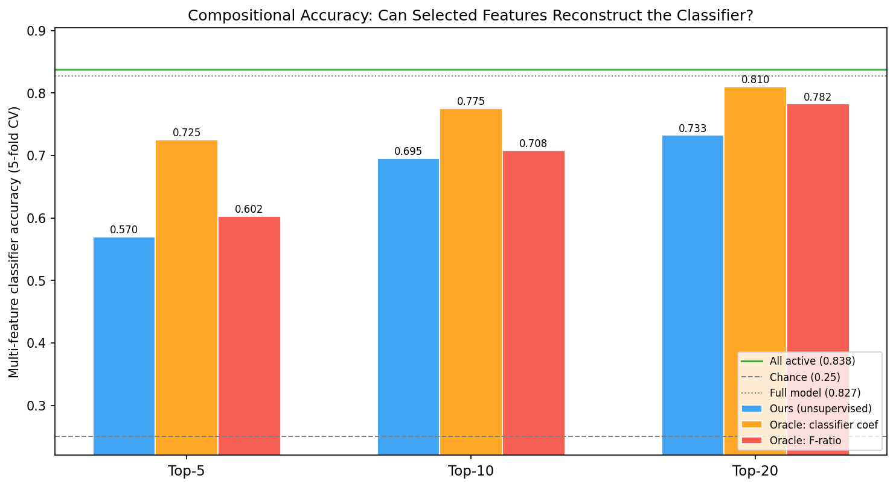
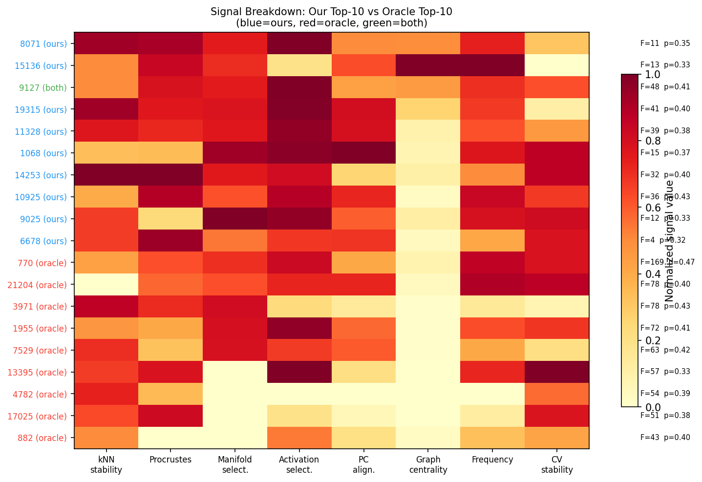
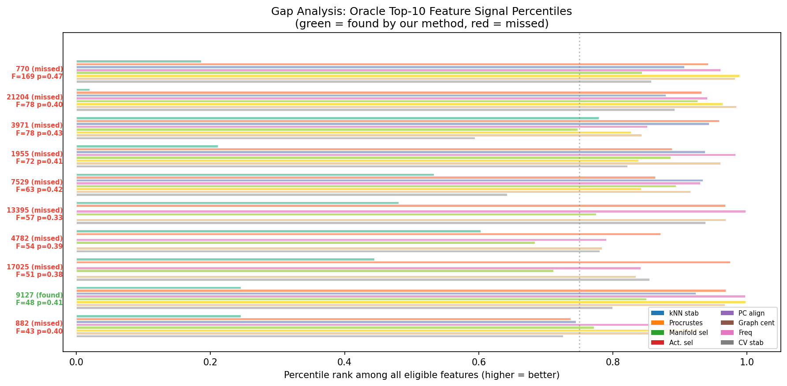

# unsup-sae

Unsupervised discovery of good classifiers from Sparse Autoencoder features.

Given a pretrained model with an SAE, identifies which SAE features are strong linear classifiers for structure in the data — **without labels or supervised training**. Combines manifold geometry on decoder directions with graph-theoretic analysis of feature co-activation patterns.

## Results

Evaluated on GPT-2 small + SAE (gpt2-small-res-jb, blocks.8.hook_resid_pre, d_sae=24576) on AG News (4-class, 400 samples). Labels never used in discovery — only in evaluation.

20 unsupervised features recover 73.3% classifier accuracy — 88% of what all 6433 active features achieve, and 90% of the supervised oracle's top-20.



## How it works

For each SAE feature, compute 7 signals from decoder weights and unlabeled activations, then score in two stages:

1. **Geometry gate** — filter features below 25th percentile on decoder geometry quality (kNN stability × Procrustes invariance × manifold selectivity)
2. **Data-driven ranking** — rank survivors by activation selectivity, PC alignment, frequency, CV stability, and graph centrality, with a dampened geometry multiplier

The heatmap below shows these 7 signals for our top-10 picks (blue) vs the oracle's top-10 (red). Our picks tend to have stronger geometry signals (left columns); the oracle's picks have higher F-ratios but weaker geometric structure.



The pipeline runs 15 times across different PC dimensions (3, 4, 6, 8, 12) and bootstrap resamples, accumulating scores with rank-weighted voting.

### Where it fails

The gap analysis shows per-signal percentiles for oracle features we missed (red) vs found (green). The main pattern: missed features like 770 (F=169) have low kNN stability and manifold selectivity despite being highly discriminative in activation space. The geometry gate filters them out.



## Usage

```bash
uv venv .venv && source .venv/bin/activate
uv pip install -r requirements.txt

python run.py --n-samples 400 --save-figures

# All arguments
python run.py \
  --model gpt2 \
  --sae-release gpt2-small-res-jb \
  --sae-id blocks.8.hook_resid_pre \
  --n-samples 400 \
  --k 30 \
  --min-cofire 3 \
  --device cuda
```

## Files

```
run.py          — Entry point: load model/SAE, discover features, evaluate, visualize
engine.py       — MetaconceptEngine: manifold geometry on decoder directions
graph.py        — FeatureGraph: co-firing graph, multi-signal scoring pipeline
visualize.py    — Benchmarking plots
figures/        — Generated outputs (--save-figures)
```

## Known limitations

- Geometry gate excludes features that are discriminative purely through activation patterns (e.g., feature 770 with F=168.9 but low kNN stability)
- Evaluated on one model/dataset/SAE combination
- Manifold similarity is the bottleneck (~21K edge evaluations)
